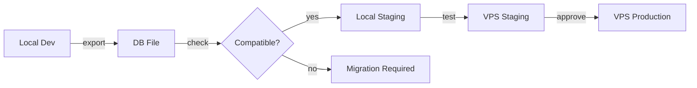

# Миграция баз данных

Руководство по экспорту, импорту и миграции SQLite баз данных между окружениями.

---

## 🎯 Обзор

Quote Calculator использует **единую схему SQLite БД** для всех окружений, что обеспечивает:

- ✅ Полную совместимость данных между окружениями
- ✅ Простой экспорт/импорт через готовые скрипты
- ✅ Автоматическую проверку целостности
- ✅ Безопасные rollback операции

---

## 📦 Окружения

### Типы окружений

| Окружение | Контейнер | Расположение БД | Назначение |
|-----------|-----------|-----------------|------------|
| **local-dev** | `quote-dev` | `./db/quotes.db` | Разработка |
| **local-staging** | `quote-staging` | Docker volume | Локальное тестирование |
| **vps-staging** | `quote-staging` | Docker volume на VPS | Финальные тесты |
| **vps-production** | `quote-production` | Docker volume на VPS | Production |

### Workflow миграции



---

## 🛠️ NPM скрипты

### Доступные команды

```bash
# ========== ЭКСПОРТ ==========

# Из локальных окружений
npm run db:export:local-dev          # Development окружение
npm run db:export:local-staging      # Local staging

# Из VPS окружений (требуется SSH)
npm run db:export:vps-staging        # VPS staging
npm run db:export:vps-production     # VPS production

# ========== ПРОВЕРКА ==========

npm run db:check <db-file>           # Проверка совместимости

# ========== ИМПОРТ ==========

npm run db:import <db-file> <target-env>

# Target env:
#   - local-dev
#   - local-staging
#   - vps-staging
#   - vps-production

# ========== БЭКАПЫ ==========

npm run db:backup:vps                # Ручной бэкап VPS production
```

---

## 📤 Экспорт базы данных

### Из локального окружения

```bash
# Экспорт из development
npm run db:export:local-dev

# Вывод:
# 🗄️ Quote Calculator - Database Export
# ========================================
# 📦 Exporting database from local container...
# ✅ Database exported successfully!
#
# 📊 Database Information:
# File size: 664K
#
# Record counts:
# estimates  42
# backups    15
# catalogs   3
# settings   1
#
# ✅ Export completed successfully!
# 📁 File: ./db-exports/quotes-local-dev-20250113_1530.db
```

### Из VPS окружения

**Требования:**
- SSH доступ к VPS
- Настроенные переменные окружения

```bash
# Настройка SSH переменных
export VPS_HOST=your-vps-ip
export VPS_USER=deployer

# Экспорт из VPS production
npm run db:export:vps-production

# Скрипт:
# 1. Подключится к VPS через SSH
# 2. Экспортирует БД из контейнера в /tmp/
# 3. Скачает файл на локальную машину
# 4. Удалит временный файл на VPS
# 5. Покажет статистику
```

!!! tip "SSH без пароля"
    Настройте SSH ключи для автоматического подключения:
    ```bash
    ssh-copy-id deployer@your-vps-ip
    ```

---

## ✅ Проверка совместимости

### Зачем проверять?

Перед импортом БД в другое окружение важно убедиться:
- ✅ Файл не поврежден
- ✅ Схема совместима
- ✅ Данные валидны
- ✅ Нет критических ошибок

### Запуск проверки

```bash
npm run db:check ./db-exports/quotes-local-dev-20250113.db
```

### Пример вывода

```
🔍 Quote Calculator - Database Compatibility Check
===================================================

🔍 Checking file existence...
✅ File exists: 664K

🔍 Checking database integrity...
✅ Integrity: OK

🔍 Checking schema version...
📋 Schema version: 1.0.0
✅ Compatible with expected version: 1.0.0

🔍 Checking table structure...

📊 Tables found:
  - estimates
  - backups
  - catalogs
  - settings
  - schema_info

Required tables:
  ✅ estimates
  ✅ backups
  ✅ catalogs
  ✅ settings

🔍 Checking record counts...

Table       Records
estimates   42
backups     15
catalogs    3
settings    1

🔍 Checking estimates table structure...

Columns:
  - id
  - filename
  - data
  - data_version
  - created_at
  - updated_at

Required columns:
  ✅ id
  ✅ filename
  ✅ data
  ✅ data_version
  ✅ created_at
  ✅ updated_at

🔍 Checking data consistency...
  ✅ All estimates have valid ids
  ✅ All estimates have valid filenames
  ✅ No duplicate ids
  ✅ No duplicate filenames
  ✅ All JSON data appears valid

📋 Database Summary:
====================
File: quotes-local-dev-20250113.db
Size: 664K
Modified: Jan 13 15:30

Total Estimates: 42
Total Backups: 15
Total Catalogs: 3

✅ Compatibility check completed!
```

---

## 📥 Импорт базы данных

### В локальное окружение

```bash
# Импорт в local staging
npm run db:import ./db-exports/quotes-local-dev-20250113.db local-staging

# Процесс:
# 1. Валидация БД файла
# 2. Показ информации о БД
# 3. Запрос подтверждения
# 4. Автоматический бэкап текущей БД
# 5. Копирование новой БД в контейнер
# 6. Перезапуск контейнера
# 7. Проверка health
```

### В VPS staging

```bash
# Настройка SSH
export VPS_HOST=your-vps-ip
export VPS_USER=deployer

# Импорт
npm run db:import ./db-exports/quotes-local-staging-20250113.db vps-staging

# Процесс:
# 1. Валидация БД файла
# 2. Показ информации о БД
# 3. Запрос подтверждения
# 4. SSH подключение к VPS
# 5. Бэкап текущей БД на VPS
# 6. Загрузка новой БД на VPS
# 7. Копирование в контейнер
# 8. Перезапуск контейнера
# 9. Проверка health
```

### В VPS production

!!! danger "Критическая операция!"
    Импорт в production требует двойного подтверждения и автоматически создает бэкап.

```bash
# Импорт в production
npm run db:import ./db-exports/quotes-staging-20250113.db vps-production

# Процесс:
# 1. Валидация БД
# 2. Показ информации
# 3. ПЕРВОЕ подтверждение: ввести "PRODUCTION"
# 4. ВТОРОЕ подтверждение: ввести "yes"
# 5. Автоматический бэкап текущей production БД
# 6. Импорт новой БД
# 7. Перезапуск контейнера
# 8. Health check

# Вывод:
# 🚨 WARNING: PRODUCTION DATABASE IMPORT 🚨
# ==========================================
#
# This will REPLACE the production database!
# All current production data will be backed up.
#
# Type 'PRODUCTION' (all caps) to confirm: PRODUCTION
#
# Are you absolutely sure? (yes/NO): yes
#
# 💾 Creating backup of current database on VPS...
# ✅ Backup created on VPS
# 📤 Uploading database to VPS...
# 📦 Installing database in container...
# 🔄 Restarting container...
# ✅ Database imported successfully to VPS!
```

---

## 💾 Автоматические бэкапы

### Настройка cron на VPS

```bash
# SSH в VPS
ssh deployer@your-vps-ip

# Редактировать crontab
crontab -e

# Добавить (ежедневный бэкап в 2:00 AM):
0 2 * * * /opt/quote-calculator/scripts/backup-vps-production.sh >> /opt/logs/backup.log 2>&1

# Сохранить и выйти
```

### Retention policy

Бэкапы хранятся согласно политике:

- **Daily backups**: 7 дней
- **Weekly backups**: 28 дней (4 недели)

Автоматическая очистка выполняется скриптом `backup-vps-production.sh`.

### Ручной бэкап

```bash
# На VPS
npm run db:backup:vps

# или напрямую
./scripts/backup-vps-production.sh

# Бэкапы сохраняются в:
/opt/backups/quote-production/daily/
/opt/backups/quote-production/weekly/
```

---

## 🔄 Типовые сценарии

### Сценарий 1: Локальная разработка → VPS Staging

```bash
# 1. Разработка и тестирование локально
# ...

# 2. Экспорт БД из local dev
npm run db:export:local-dev

# 3. Проверка совместимости
npm run db:check ./db-exports/quotes-local-dev-20250113_1530.db

# 4. Импорт в local staging для локальных тестов
npm run db:import ./db-exports/quotes-local-dev-20250113_1530.db local-staging

# 5. После успешного локального теста - импорт в VPS staging
export VPS_HOST=your-vps-ip
export VPS_USER=deployer
npm run db:import ./db-exports/quotes-local-dev-20250113_1530.db vps-staging

# 6. Финальное тестирование на https://staging.yourdomain.com
```

### Сценарий 2: VPS Staging → VPS Production

```bash
# 1. Финальное тестирование на staging прошло успешно

# 2. Экспорт БД из staging
export VPS_HOST=your-vps-ip
export VPS_USER=deployer
npm run db:export:vps-staging

# 3. Проверка совместимости
npm run db:check ./db-exports/quotes-vps-staging-20250113_1600.db

# 4. Бэкап production (на всякий случай)
npm run db:export:vps-production

# 5. Импорт в production (с подтверждением)
npm run db:import ./db-exports/quotes-vps-staging-20250113_1600.db vps-production

# 6. Проверка production
curl https://yourdomain.com/health
```

### Сценарий 3: Rollback после проблемного деплоя

```bash
# 1. Обнаружена проблема после деплоя

# 2. Найти последний бэкап
ls -lt ./db-exports/backups/

# 3. Проверить бэкап
npm run db:check ./db-exports/backups/backup-before-import-20250113_1600.db

# 4. Восстановить из бэкапа
npm run db:import ./db-exports/backups/backup-before-import-20250113_1600.db vps-production

# 5. Проверка
curl https://yourdomain.com/health
```

---

## 📊 Структура БД

### Основные таблицы

#### estimates
Основная таблица со сметами:
```sql
CREATE TABLE estimates (
    id TEXT PRIMARY KEY,           -- UUID
    filename TEXT NOT NULL,         -- Имя файла (для UI)
    data TEXT NOT NULL,            -- JSON с полными данными сметы
    data_version INTEGER DEFAULT 1, -- Optimistic locking
    created_at TEXT DEFAULT CURRENT_TIMESTAMP,
    updated_at TEXT DEFAULT CURRENT_TIMESTAMP,
    UNIQUE(filename)
);
```

#### backups
Бэкапы смет:
```sql
CREATE TABLE backups (
    id TEXT PRIMARY KEY,           -- UUID (связан с estimate id)
    filename TEXT NOT NULL,
    data TEXT NOT NULL,
    created_at TEXT DEFAULT CURRENT_TIMESTAMP,
    updated_at TEXT DEFAULT CURRENT_TIMESTAMP
);
```

#### catalogs
Каталоги услуг:
```sql
CREATE TABLE catalogs (
    id INTEGER PRIMARY KEY AUTOINCREMENT,
    filename TEXT NOT NULL UNIQUE,
    data TEXT NOT NULL,
    created_at TEXT DEFAULT CURRENT_TIMESTAMP,
    updated_at TEXT DEFAULT CURRENT_TIMESTAMP
);
```

#### settings
Настройки приложения:
```sql
CREATE TABLE settings (
    id INTEGER PRIMARY KEY,
    data TEXT NOT NULL,
    updated_at TEXT DEFAULT CURRENT_TIMESTAMP
);
```

#### schema_info
Версия схемы БД:
```sql
CREATE TABLE schema_info (
    id INTEGER PRIMARY KEY,
    version TEXT NOT NULL,
    updated_at TEXT DEFAULT CURRENT_TIMESTAMP
);
```

---

## 🔒 Безопасность

### Best practices

1. **Всегда делайте бэкап перед импортом**
   ```bash
   # Автоматически создается скриптом import-db.sh
   # Дополнительный ручной бэкап:
   npm run db:export:vps-production
   ```

2. **Проверяйте совместимость**
   ```bash
   npm run db:check <db-file>
   ```

3. **Тестируйте на staging перед production**
   ```bash
   # Сначала staging
   npm run db:import <file> vps-staging
   # Тестирование...
   # Потом production
   npm run db:import <file> vps-production
   ```

4. **Храните бэкапы в безопасном месте**
   ```bash
   # Копируйте критичные бэкапы в другое место
   scp deployer@vps:/opt/backups/quote-production/daily/*.db \
       ~/backups/quote-production/
   ```

5. **Используйте version control для схемы**
   - Все изменения схемы БД должны быть в миграциях
   - Версионируйте миграции в Git
   - Документируйте breaking changes

---

## 🐛 Troubleshooting

### Проблема: SSH connection failed

```bash
# Проверить SSH подключение
ssh deployer@your-vps-ip "echo 'SSH OK'"

# Если не работает - проверить переменные
echo $VPS_HOST
echo $VPS_USER

# Установить заново
export VPS_HOST=your-vps-ip
export VPS_USER=deployer
```

### Проблема: sqlite3 not found

```bash
# macOS
brew install sqlite3

# Ubuntu/Debian
sudo apt install sqlite3

# Проверка
sqlite3 --version
```

### Проблема: Database is locked

```bash
# Остановить контейнер
docker stop quote-production

# Экспорт
npm run db:export:vps-production

# Запустить контейнер
docker start quote-production
```

### Проблема: Integrity check failed

```bash
# Попробовать восстановить БД
sqlite3 corrupted.db ".recover" | sqlite3 recovered.db

# Проверить восстановленную БД
npm run db:check recovered.db
```

### Проблема: Import fails with "Container not running"

```bash
# Проверить статус контейнера
docker ps | grep quote

# Запустить контейнер если остановлен
docker start quote-production

# Проверить логи
docker logs quote-production
```

---

## 📚 Дополнительные ресурсы

- [SQLite Documentation](https://www.sqlite.org/docs.html)
- [SQLite CLI](https://www.sqlite.org/cli.html)
- [Data Integrity Guide](../data-integrity/index.md)
- [Backup Strategies](production.md#backup-strategies)

---

[← Назад к Deployment](index.md) | [Monitoring →](monitoring.md)
