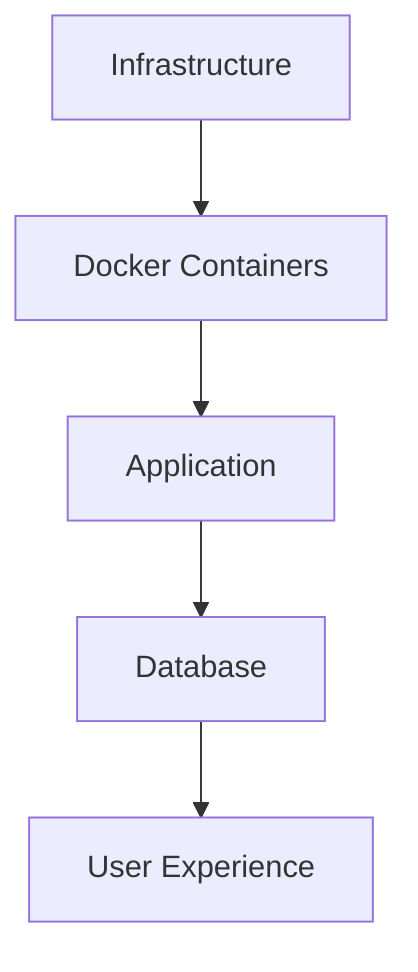

# Мониторинг и управление

Комплексное руководство по мониторингу Quote Calculator в production окружении.

---

## 🎯 Обзор

Эффективный мониторинг обеспечивает:
- ✅ Раннее обнаружение проблем
- ✅ Быстрое реагирование на инциденты
- ✅ Понимание производительности системы
- ✅ Планирование масштабирования

### Уровни мониторинга



---

## 🏥 Health Checks

### Application Health Endpoint

Quote Calculator предоставляет встроенный health check endpoint.

```bash
# Проверка production
curl https://yourdomain.com/health

# Проверка staging
curl https://staging.yourdomain.com/health

# Response (JSON):
{
  "status": "healthy",
  "version": "2.3.0",
  "storage": "sqlite",
  "database": "connected",
  "uptime": 86400,
  "timestamp": "2025-01-13T16:00:00Z"
}
```

### Automated Health Monitoring

#### Скрипт для cron

```bash
# Создать скрипт мониторинга
cat > /opt/scripts/health-monitor.sh << 'EOF'
#!/bin/bash
set -e

URL="https://yourdomain.com/health"
ALERT_EMAIL="admin@yourdomain.com"

# Health check
RESPONSE=$(curl -s -o /dev/null -w "%{http_code}" $URL)

if [ "$RESPONSE" != "200" ]; then
    MESSAGE="❌ Health check failed: HTTP $RESPONSE"
    echo "$MESSAGE" | mail -s "Quote Calculator Alert" $ALERT_EMAIL
    echo "$(date): $MESSAGE" >> /var/log/quote-health.log
    exit 1
fi

echo "$(date): ✅ Health check passed"
EOF

chmod +x /opt/scripts/health-monitor.sh

# Добавить в cron (каждые 5 минут)
crontab -e
# Добавить строку:
*/5 * * * * /opt/scripts/health-monitor.sh >> /var/log/quote-health.log 2>&1
```

#### Uptime monitoring (внешний сервис)

Используйте сервисы для мониторинга доступности:

**UptimeRobot** (бесплатно до 50 мониторов):
1. Зарегистрироваться на [uptimerobot.com](https://uptimerobot.com)
2. Add New Monitor
3. Monitor Type: HTTP(s)
4. URL: `https://yourdomain.com/health`
5. Monitoring Interval: 5 minutes
6. Alert Contacts: ваш email/Telegram

**Альтернативы:**
- [Pingdom](https://www.pingdom.com/) - более продвинутый
- [StatusCake](https://www.statuscake.com/) - бесплатный tier
- [Freshping](https://www.freshworks.com/website-monitoring/) - бесплатно

---

## 📊 Docker Monitoring

### Portainer Dashboard

Portainer предоставляет web UI для управления Docker контейнерами.

**Доступ:**
```
https://your-vps-ip:9443
```

**Что смотреть:**
- **Containers** - статус, CPU, memory usage
- **Images** - размер образов, версии
- **Volumes** - использование дискового пространства
- **Networks** - сетевые подключения
- **Logs** - логи контейнеров в реальном времени

### Docker Stats (CLI)

```bash
# Мониторинг всех контейнеров
docker stats

# Output:
CONTAINER ID   NAME              CPU %   MEM USAGE / LIMIT   MEM %   NET I/O
abc123         quote-production  0.5%    120MiB / 4GiB       3%      1.2MB / 800KB
def456         quote-staging     0.3%    90MiB / 4GiB        2.25%   800KB / 500KB
ghi789         quote-nginx       0.1%    50MiB / 4GiB        1.25%   5MB / 3MB

# Только production контейнер
docker stats quote-production --no-stream

# С форматированием
docker stats --format "table {{.Name}}\t{{.CPUPerc}}\t{{.MemUsage}}"
```

### Resource Limits

Установка лимитов для контейнеров (в docker-compose.vps.yml):

```yaml
services:
  quote-production:
    # ... other config
    deploy:
      resources:
        limits:
          cpus: '1.0'      # Максимум 1 CPU core
          memory: 512M     # Максимум 512MB RAM
        reservations:
          cpus: '0.5'      # Зарезервировать 0.5 core
          memory: 256M     # Зарезервировать 256MB
```

---

## 📝 Логирование

### Application Logs

#### Просмотр логов

```bash
# Production logs (последние 100 строк)
docker logs quote-production --tail 100

# Follow logs (real-time)
docker logs quote-production -f

# Staging logs
docker logs quote-staging -f

# Nginx logs
docker logs quote-nginx --tail 50

# Certbot logs
docker logs quote-certbot --tail 20
```

#### Логи внутри контейнера

```bash
# SSH в контейнер
docker exec -it quote-production /bin/sh

# Просмотр application logs
cat /app/logs/app.log
tail -f /app/logs/app.log

# Просмотр error logs
cat /app/logs/error.log

# Выход из контейнера
exit
```

### Log Levels

Quote Calculator использует Winston для логирования:

| Level | Environment | Что логируется |
|-------|-------------|----------------|
| **error** | Production | Только критические ошибки |
| **warn** | Production | Ошибки + предупреждения |
| **info** | Production | Важные события |
| **debug** | Staging | Детальная отладочная информация |

### Log Rotation

Настройка ротации логов для предотвращения переполнения диска:

```bash
# Создать конфигурацию logrotate
sudo cat > /etc/logrotate.d/quote-calculator << 'EOF'
/var/lib/docker/volumes/quote-prod-logs/_data/*.log
/var/lib/docker/volumes/quote-staging-logs/_data/*.log {
    daily
    rotate 14
    compress
    delaycompress
    missingok
    notifempty
    create 0644 root root
    sharedscripts
    postrotate
        docker exec quote-production kill -USR1 1 2>/dev/null || true
        docker exec quote-staging kill -USR1 1 2>/dev/null || true
    endscript
}
EOF

# Тест конфигурации
sudo logrotate -d /etc/logrotate.d/quote-calculator

# Принудительная ротация (для теста)
sudo logrotate -f /etc/logrotate.d/quote-calculator
```

### Centralized Logging (опционально)

Для production-grade решения можно настроить централизованное логирование:

#### Вариант 1: ELK Stack

```yaml
# docker-compose.logging.yml
services:
  elasticsearch:
    image: elasticsearch:8.11.0
    environment:
      - discovery.type=single-node
    volumes:
      - elk-data:/usr/share/elasticsearch/data

  logstash:
    image: logstash:8.11.0
    volumes:
      - ./logstash.conf:/usr/share/logstash/pipeline/logstash.conf

  kibana:
    image: kibana:8.11.0
    ports:
      - "5601:5601"
    depends_on:
      - elasticsearch
```

#### Вариант 2: Loki + Grafana

Более легковесное решение:

```yaml
services:
  loki:
    image: grafana/loki:latest
    ports:
      - "3100:3100"

  grafana:
    image: grafana/grafana:latest
    ports:
      - "3000:3000"
```

---

## 💾 Database Monitoring

### Database Size Tracking

```bash
# Проверить размер БД production
docker exec quote-production ls -lh /app/db/quotes.db

# Output:
-rw-r--r-- 1 node node 12M Jan 13 16:00 /app/db/quotes.db

# Проверить размер БД staging
docker exec quote-staging ls -lh /app/db/quotes.db

# Использование Docker volume
docker system df -v | grep quote
```

### Database Performance

```bash
# SSH в production контейнер
docker exec -it quote-production /bin/sh

# Анализ БД с помощью SQLite CLI
sqlite3 /app/db/quotes.db

# В sqlite3 консоли:
.timer on
.stats on

-- Проверить размер таблиц
SELECT name,
       (SELECT COUNT(*) FROM sqlite_master WHERE type='table') as total_tables,
       (SELECT COUNT(*) FROM estimates) as estimates_count,
       (SELECT COUNT(*) FROM backups) as backups_count
FROM sqlite_master
WHERE type='table'
LIMIT 1;

-- Анализ индексов
.indexes

-- Vacuum для оптимизации
VACUUM;

-- Выход
.exit
```

### Automated Database Checks

```bash
# Скрипт проверки целостности БД
cat > /opt/scripts/db-integrity-check.sh << 'EOF'
#!/bin/bash
set -e

CONTAINER="quote-production"
DB_PATH="/app/db/quotes.db"

# Integrity check
echo "🔍 Checking database integrity..."
INTEGRITY=$(docker exec $CONTAINER sqlite3 $DB_PATH "PRAGMA integrity_check;")

if [ "$INTEGRITY" != "ok" ]; then
    echo "❌ Database integrity check FAILED!"
    echo "$INTEGRITY" | mail -s "DB Integrity Alert" admin@yourdomain.com
    exit 1
fi

echo "✅ Database integrity: OK"

# Size check
SIZE=$(docker exec $CONTAINER du -h $DB_PATH | cut -f1)
echo "📊 Database size: $SIZE"

# Record counts
ESTIMATES=$(docker exec $CONTAINER sqlite3 $DB_PATH "SELECT COUNT(*) FROM estimates;")
BACKUPS=$(docker exec $CONTAINER sqlite3 $DB_PATH "SELECT COUNT(*) FROM backups;")

echo "📋 Estimates: $ESTIMATES"
echo "💾 Backups: $BACKUPS"
EOF

chmod +x /opt/scripts/db-integrity-check.sh

# Добавить в cron (ежедневно в 3:00 AM)
0 3 * * * /opt/scripts/db-integrity-check.sh >> /var/log/db-integrity.log 2>&1
```

---

## 🔔 Alerting

### Email Alerts

Настройка email уведомлений через postfix:

```bash
# Установить postfix
sudo apt install postfix mailutils -y

# Настроить для отправки через Gmail (пример)
sudo cat > /etc/postfix/sasl_passwd << 'EOF'
[smtp.gmail.com]:587 your-email@gmail.com:your-app-password
EOF

sudo postmap /etc/postfix/sasl_passwd
sudo chmod 600 /etc/postfix/sasl_passwd*

# Настроить postfix
sudo nano /etc/postfix/main.cf
# Добавить:
relayhost = [smtp.gmail.com]:587
smtp_use_tls = yes
smtp_sasl_auth_enable = yes
smtp_sasl_password_maps = hash:/etc/postfix/sasl_passwd
smtp_sasl_security_options = noanonymous

# Перезапустить
sudo systemctl restart postfix

# Тест
echo "Test email" | mail -s "Test" admin@yourdomain.com
```

### Telegram Alerts

Более удобная альтернатива email:

```bash
# Создать Telegram бота (через @BotFather)
# Получить chat_id (отправить сообщение боту и получить через API)

# Скрипт для отправки в Telegram
cat > /opt/scripts/telegram-notify.sh << 'EOF'
#!/bin/bash

BOT_TOKEN="YOUR_BOT_TOKEN"
CHAT_ID="YOUR_CHAT_ID"
MESSAGE="$1"

curl -s -X POST "https://api.telegram.org/bot$BOT_TOKEN/sendMessage" \
    -d chat_id="$CHAT_ID" \
    -d text="$MESSAGE" \
    -d parse_mode="HTML"
EOF

chmod +x /opt/scripts/telegram-notify.sh

# Использование
/opt/scripts/telegram-notify.sh "✅ Deploy completed successfully"
```

### Alert Integration Examples

```bash
# В скриптах мониторинга заменить mail на telegram-notify:

# Было:
echo "Error" | mail -s "Alert" admin@example.com

# Стало:
/opt/scripts/telegram-notify.sh "❌ <b>Alert:</b> Error detected"
```

---

## 📈 Performance Metrics

### System Metrics

```bash
# CPU usage
top -bn1 | grep "Cpu(s)"

# Memory usage
free -h

# Disk usage
df -h

# I/O stats
iostat -x 1 5

# Network stats
netstat -s
```

### Application Metrics

#### Response Time Monitoring

```bash
# Скрипт замера времени ответа
cat > /opt/scripts/response-time-check.sh << 'EOF'
#!/bin/bash

URL="https://yourdomain.com/health"
LOG_FILE="/var/log/response-times.log"

# Замер времени
RESPONSE_TIME=$(curl -o /dev/null -s -w '%{time_total}' $URL)
STATUS_CODE=$(curl -o /dev/null -s -w '%{http_code}' $URL)

# Запись в лог
echo "$(date +%s),$STATUS_CODE,$RESPONSE_TIME" >> $LOG_FILE

# Alert если > 1 секунда
if (( $(echo "$RESPONSE_TIME > 1.0" | bc -l) )); then
    /opt/scripts/telegram-notify.sh "⚠️ Slow response: ${RESPONSE_TIME}s"
fi
EOF

chmod +x /opt/scripts/response-time-check.sh

# Запуск каждую минуту
* * * * * /opt/scripts/response-time-check.sh
```

### Simple Dashboard

Создание простого dashboard для метрик:

```bash
# Создать HTML dashboard
cat > /var/www/html/metrics.html << 'EOF'
<!DOCTYPE html>
<html>
<head>
    <title>Quote Calculator Metrics</title>
    <meta http-equiv="refresh" content="30">
    <style>
        body { font-family: monospace; padding: 20px; }
        .metric { margin: 10px 0; padding: 10px; background: #f0f0f0; }
        .ok { color: green; }
        .warn { color: orange; }
        .error { color: red; }
    </style>
</head>
<body>
    <h1>Quote Calculator Metrics</h1>
    <div id="metrics"></div>
    <script>
        // Fetch metrics from endpoints
        fetch('/api/metrics').then(r => r.json()).then(data => {
            document.getElementById('metrics').innerHTML = `
                <div class="metric">Status: <span class="${data.status}">${data.status}</span></div>
                <div class="metric">Uptime: ${data.uptime}s</div>
                <div class="metric">Memory: ${data.memory}</div>
                <div class="metric">Database: ${data.database}</div>
            `;
        });
    </script>
</body>
</html>
EOF
```

---

## 🔒 SSL Certificate Monitoring

### Certificate Expiry Checks

```bash
# Проверить срок действия сертификата
echo | openssl s_client -connect yourdomain.com:443 -servername yourdomain.com 2>/dev/null | \
  openssl x509 -noout -dates

# Output:
# notBefore=Jan 13 00:00:00 2025 GMT
# notAfter=Apr 13 23:59:59 2025 GMT

# Скрипт мониторинга срока действия
cat > /opt/scripts/ssl-expiry-check.sh << 'EOF'
#!/bin/bash
set -e

DOMAIN="yourdomain.com"
DAYS_BEFORE_EXPIRY=7

EXPIRY_DATE=$(echo | openssl s_client -connect $DOMAIN:443 -servername $DOMAIN 2>/dev/null | \
  openssl x509 -noout -enddate | cut -d= -f2)

EXPIRY_EPOCH=$(date -d "$EXPIRY_DATE" +%s)
NOW_EPOCH=$(date +%s)
DAYS_LEFT=$(( ($EXPIRY_EPOCH - $NOW_EPOCH) / 86400 ))

echo "📅 SSL certificate expires in $DAYS_LEFT days"

if [ $DAYS_LEFT -lt $DAYS_BEFORE_EXPIRY ]; then
    MESSAGE="⚠️ SSL certificate for $DOMAIN expires in $DAYS_LEFT days!"
    echo "$MESSAGE"
    /opt/scripts/telegram-notify.sh "$MESSAGE"
fi
EOF

chmod +x /opt/scripts/ssl-expiry-check.sh

# Запуск ежедневно
0 9 * * * /opt/scripts/ssl-expiry-check.sh >> /var/log/ssl-check.log 2>&1
```

---

## 💾 Backup Monitoring

### Backup Status Checks

```bash
# Проверить последний backup
ls -lth /opt/backups/quote-production/daily/ | head -5

# Скрипт проверки backup'ов
cat > /opt/scripts/backup-check.sh << 'EOF'
#!/bin/bash
set -e

BACKUP_DIR="/opt/backups/quote-production/daily"
MAX_AGE_HOURS=26  # 1 day + 2 hours buffer

# Найти последний backup
LATEST_BACKUP=$(ls -t $BACKUP_DIR/*.db 2>/dev/null | head -1)

if [ -z "$LATEST_BACKUP" ]; then
    MESSAGE="❌ No backups found!"
    echo "$MESSAGE"
    /opt/scripts/telegram-notify.sh "$MESSAGE"
    exit 1
fi

# Проверить возраст
BACKUP_TIME=$(stat -c %Y "$LATEST_BACKUP")
NOW=$(date +%s)
AGE_HOURS=$(( ($NOW - $BACKUP_TIME) / 3600 ))

echo "📦 Latest backup: $(basename $LATEST_BACKUP)"
echo "🕐 Age: $AGE_HOURS hours"

if [ $AGE_HOURS -gt $MAX_AGE_HOURS ]; then
    MESSAGE="⚠️ Last backup is too old: $AGE_HOURS hours"
    echo "$MESSAGE"
    /opt/scripts/telegram-notify.sh "$MESSAGE"
    exit 1
fi

echo "✅ Backup is fresh"
EOF

chmod +x /opt/scripts/backup-check.sh

# Запуск дважды в день
0 9,21 * * * /opt/scripts/backup-check.sh >> /var/log/backup-check.log 2>&1
```

---

## 🎛️ Monitoring Dashboard (Grafana)

### Установка Grafana (опционально)

Для production-grade мониторинга:

```yaml
# docker-compose.monitoring.yml
services:
  prometheus:
    image: prom/prometheus:latest
    volumes:
      - ./prometheus.yml:/etc/prometheus/prometheus.yml
      - prometheus-data:/prometheus
    ports:
      - "9090:9090"

  grafana:
    image: grafana/grafana:latest
    ports:
      - "3001:3000"
    environment:
      - GF_SECURITY_ADMIN_PASSWORD=your-password
    volumes:
      - grafana-data:/var/lib/grafana
    depends_on:
      - prometheus

volumes:
  prometheus-data:
  grafana-data:
```

### Prometheus Configuration

```yaml
# prometheus.yml
global:
  scrape_interval: 15s

scrape_configs:
  - job_name: 'quote-calculator'
    static_configs:
      - targets: ['quote-production:4000']
```

---

## 📊 Summary Dashboard

Создание сводного dashboard для быстрой проверки:

```bash
# Скрипт сводной информации
cat > /opt/scripts/status-summary.sh << 'EOF'
#!/bin/bash

echo "================================"
echo "Quote Calculator Status Summary"
echo "================================"
echo ""

# Health check
echo "🏥 Health Check:"
HEALTH=$(curl -s https://yourdomain.com/health | jq -r '.status')
echo "   Production: $HEALTH"

# Container status
echo ""
echo "🐳 Docker Containers:"
docker ps --format "table {{.Names}}\t{{.Status}}\t{{.Ports}}" | grep quote

# Resource usage
echo ""
echo "💻 Resource Usage:"
docker stats --no-stream --format "table {{.Name}}\t{{.CPUPerc}}\t{{.MemUsage}}" | grep quote

# Database size
echo ""
echo "💾 Database:"
PROD_SIZE=$(docker exec quote-production du -h /app/db/quotes.db 2>/dev/null | cut -f1)
echo "   Production DB: $PROD_SIZE"

# Last backup
echo ""
echo "📦 Last Backup:"
LAST_BACKUP=$(ls -t /opt/backups/quote-production/daily/*.db 2>/dev/null | head -1)
if [ -n "$LAST_BACKUP" ]; then
    BACKUP_AGE=$(( ($(date +%s) - $(stat -c %Y "$LAST_BACKUP")) / 3600 ))
    echo "   $(basename $LAST_BACKUP) ($BACKUP_AGE hours ago)"
else
    echo "   ❌ No backups found"
fi

# SSL expiry
echo ""
echo "🔒 SSL Certificate:"
DAYS_LEFT=$(( ($(date -d "$(echo | openssl s_client -connect yourdomain.com:443 2>/dev/null | \
  openssl x509 -noout -enddate | cut -d= -f2)" +%s) - $(date +%s)) / 86400 ))
echo "   Expires in $DAYS_LEFT days"

echo ""
echo "================================"
EOF

chmod +x /opt/scripts/status-summary.sh

# Запуск
/opt/scripts/status-summary.sh
```

---

## 📚 Best Practices

### Мониторинг

1. **Многоуровневый подход**
   - Infrastructure (VPS)
   - Containers (Docker)
   - Application (Node.js)
   - Database (SQLite)

2. **Проактивность**
   - Настроить alerts до проблем
   - Мониторить тренды, не только текущее состояние
   - Автоматизировать проверки

3. **Централизация**
   - Собирать все логи в одном месте
   - Единый dashboard для всех метрик
   - Корреляция событий между компонентами

### Алертинг

1. **Правильные пороги**
   - Не слишком чувствительные (шум)
   - Не слишком грубые (пропуск проблем)
   - Тюнинг на основе истории

2. **Приоритизация**
   - Critical: требует немедленного действия
   - Warning: требует внимания
   - Info: для статистики

3. **Каналы уведомлений**
   - Email для некритичных
   - Telegram/SMS для критичных
   - Escalation при no response

---

## 📚 Дополнительные ресурсы

- [VPS Setup](vps-setup.md)
- [Configuration](configuration.md)
- [Workflow](workflow.md)
- [Troubleshooting](troubleshooting.md)
- [Prometheus Documentation](https://prometheus.io/docs/)
- [Grafana Documentation](https://grafana.com/docs/)

---

[← Workflow](workflow.md) | [Troubleshooting →](troubleshooting.md)
