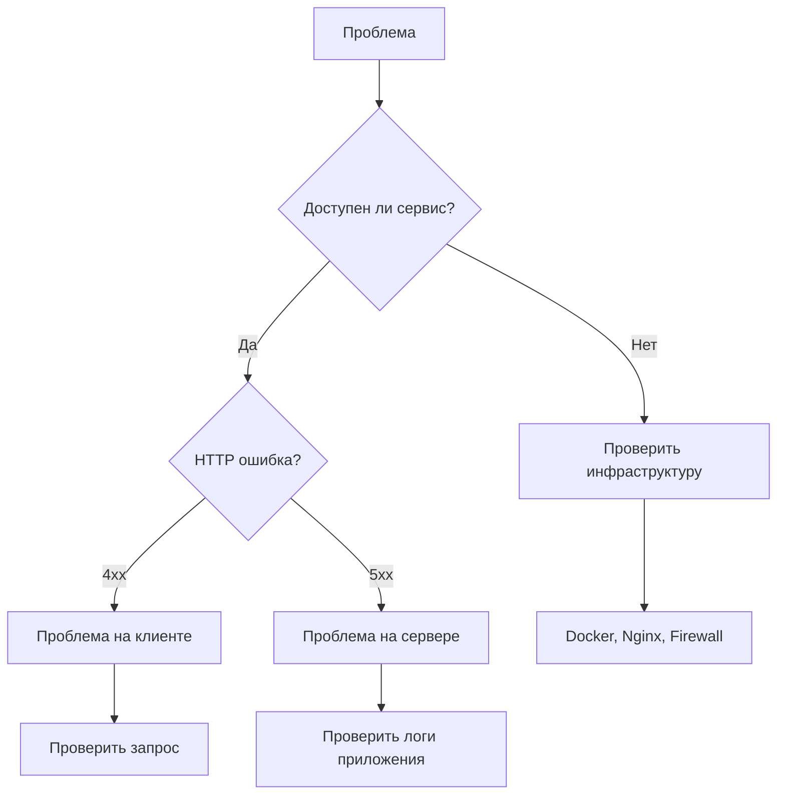

# Troubleshooting

Комплексное руководство по диагностике и решению проблем в Quote Calculator.

---

## 🎯 Обзор

Эта страница содержит решения для **наиболее частых проблем** при развертывании и эксплуатации Quote Calculator.

### Порядок диагностики



---

## 🚨 Общие проблемы

### Проблема: Сайт недоступен

#### Симптомы
```bash
curl https://yourdomain.com
# curl: (7) Failed to connect to yourdomain.com port 443: Connection refused
```

#### Диагностика

**Шаг 1: Проверить DNS**
```bash
# Проверить что домен резолвится в IP вашего VPS
dig yourdomain.com +short

# Должен вернуть IP вашего VPS
# Если пусто - проблема в DNS
```

**Решение для DNS:**
- Проверить A-записи в панели DNS провайдера
- Подождать DNS propagation (до 24 часов)
- Проверить на https://www.whatsmydns.net/

**Шаг 2: Проверить firewall**
```bash
# SSH в VPS
ssh deployer@your-vps-ip

# Проверить статус firewall
sudo ufw status

# Порты 80 и 443 должны быть открыты:
# 80/tcp                     ALLOW       Anywhere
# 443/tcp                    ALLOW       Anywhere

# Если закрыты - открыть
sudo ufw allow 80/tcp
sudo ufw allow 443/tcp
```

**Шаг 3: Проверить Nginx**
```bash
# Статус контейнера
docker ps | grep nginx

# Если остановлен - запустить
docker compose -f docker-compose.vps.yml up -d nginx

# Проверить логи
docker logs quote-nginx --tail 50

# Проверить конфигурацию
docker exec quote-nginx nginx -t
```

**Шаг 4: Проверить SSL сертификат**
```bash
# Проверить наличие сертификата
docker exec quote-nginx ls -la /etc/letsencrypt/live/

# Если сертификата нет - получить
docker compose -f docker-compose.vps.yml --profile init run --rm certbot-init

# Перезапустить Nginx
docker compose -f docker-compose.vps.yml restart nginx
```

---

### Проблема: 502 Bad Gateway

#### Симптомы
```
Nginx returns: 502 Bad Gateway
```

#### Причины и решения

**Причина 1: Backend контейнер не запущен**
```bash
# Проверить статус
docker ps | grep quote-production

# Если остановлен
docker compose -f docker-compose.vps.yml up -d quote-production

# Проверить логи запуска
docker logs quote-production
```

**Причина 2: Backend слушает неправильный порт**
```bash
# Проверить что приложение слушает порт 4000
docker exec quote-production netstat -tulpn | grep 4000

# Проверить .env.production
cat .env.production | grep PORT
# Должно быть: PORT=4000

# Если неправильно - исправить и перезапустить
docker compose -f docker-compose.vps.yml restart quote-production
```

**Причина 3: Проблема с Docker сетью**
```bash
# Проверить что контейнеры в одной сети
docker network inspect quote-vps-network

# Проверить DNS резолюцию внутри Nginx
docker exec quote-nginx ping quote-production -c 1

# Если не пингуется - пересоздать сеть
docker compose -f docker-compose.vps.yml down
docker compose -f docker-compose.vps.yml up -d
```

**Причина 4: Backend упал из-за ошибки**
```bash
# Проверить логи
docker logs quote-production --tail 100

# Найти ошибку и исправить
# Перезапустить после фикса
docker compose -f docker-compose.vps.yml restart quote-production
```

---

### Проблема: 413 Request Entity Too Large

#### Симптомы
При загрузке файлов больше 1MB возникает ошибка 413.

#### Решение

**В Nginx конфигурации увеличить client_max_body_size:**

```bash
# Редактировать nginx/conf.d/quotes.conf
nano nginx/conf.d/quotes.conf

# Добавить в server блок:
server {
    # ... other config ...

    client_max_body_size 10M;  # Увеличить до 10MB

    # ... rest of config ...
}

# Проверить конфигурацию
docker exec quote-nginx nginx -t

# Перезагрузить Nginx
docker exec quote-nginx nginx -s reload
```

---

## 🐳 Проблемы Docker

### Проблема: Cannot connect to Docker daemon

#### Симптомы
```bash
docker ps
# Cannot connect to the Docker daemon at unix:///var/run/docker.sock
```

#### Решение

**Причина 1: Docker не запущен**
```bash
# Проверить статус
sudo systemctl status docker

# Запустить Docker
sudo systemctl start docker

# Включить автозапуск
sudo systemctl enable docker
```

**Причина 2: Недостаточно прав**
```bash
# Добавить пользователя в группу docker
sudo usermod -aG docker $USER

# Выйти и войти заново для применения
exit
ssh deployer@your-vps-ip

# Проверка
docker ps
```

---

### Проблема: No space left on device

#### Симптомы
```bash
docker build ...
# Error: no space left on device
```

#### Диагностика
```bash
# Проверить дисковое пространство
df -h

# Проверить использование Docker
docker system df

# Output:
TYPE            TOTAL     ACTIVE    SIZE      RECLAIMABLE
Images          10        5         2.5GB     1.2GB (48%)
Containers      15        5         500MB     300MB (60%)
Local Volumes   8         3         1.5GB     800MB (53%)
Build Cache     45        0         3.2GB     3.2GB (100%)
```

#### Решение

**Очистка неиспользуемых ресурсов:**
```bash
# Удалить неиспользуемые образы, контейнеры, сети
docker system prune -a

# Удалить неиспользуемые volumes (ОСТОРОЖНО!)
docker volume prune

# Удалить build cache
docker builder prune -a

# Освободить место в системе
sudo apt autoremove
sudo apt clean
```

**Если проблема осталась:**
```bash
# Проверить большие файлы
sudo du -h / | sort -rh | head -20

# Очистить логи
sudo journalctl --vacuum-time=7d

# Найти большие Docker volumes
docker volume ls -q | xargs docker volume inspect | \
  jq -r '.[] | "\(.Mountpoint) \(.Name)"' | \
  xargs -I {} sh -c 'du -sh {}'
```

---

### Проблема: Container keeps restarting

#### Симптомы
```bash
docker ps
# CONTAINER ID   STATUS
# abc123         Restarting (1) 10 seconds ago
```

#### Диагностика
```bash
# Проверить логи
docker logs quote-production --tail 100

# Проверить причину последнего выхода
docker inspect quote-production | jq '.[0].State'

# Output покажет:
# "ExitCode": 1
# "Error": "..."
```

#### Типичные причины

**Причина 1: Порт уже занят**
```bash
# Найти что занимает порт 4000
sudo lsof -i :4000

# Остановить процесс или изменить порт в .env
```

**Причина 2: Ошибка в .env файле**
```bash
# Проверить синтаксис .env
cat .env.production

# Убедиться что нет пустых строк с переменными
# Правильно:
PORT=4000

# Неправильно:
PORT=
```

**Причина 3: Database не создалась**
```bash
# Проверить volume
docker volume inspect quote-prod-db

# Пересоздать volume
docker compose -f docker-compose.vps.yml down
docker volume rm quote-prod-db
docker compose -f docker-compose.vps.yml up -d
```

---

## 💾 Проблемы с базой данных

### Проблема: database is locked

#### Симптомы
```bash
# В логах:
Error: SQLITE_BUSY: database is locked
```

#### Причины
- Два процесса пытаются писать одновременно
- Некорректное завершение предыдущей транзакции
- Файл БД на NFS (не поддерживается)

#### Решение

**Шаг 1: Проверить количество подключений**
```bash
# Перезапустить контейнер
docker restart quote-production

# Проверить что только один процесс использует БД
docker exec quote-production lsof /app/db/quotes.db
```

**Шаг 2: Увеличить timeout в SQLite**
```javascript
// В server.js или storage конфигурации
const db = new sqlite3.Database(dbPath, (err) => {
    if (err) return callback(err);

    // Увеличить busy timeout до 10 секунд
    db.run('PRAGMA busy_timeout = 10000', callback);
});
```

**Шаг 3: Проверить что БД не на NFS**
```bash
# SQLite не работает корректно на NFS
# Используйте локальные volumes
docker volume inspect quote-prod-db
# "Driver": "local"  <-- должно быть local
```

---

### Проблема: database disk image is malformed

#### Симптомы
```bash
Error: database disk image is malformed
```

#### Диагностика
```bash
# Проверить целостность БД
docker exec quote-production sqlite3 /app/db/quotes.db "PRAGMA integrity_check;"

# Если не "ok" - БД повреждена
```

#### Решение

**Попытка восстановления:**
```bash
# Экспорт данных
docker exec quote-production sqlite3 /app/db/quotes.db ".dump" > dump.sql

# Создать новую БД из дампа
cat dump.sql | docker exec -i quote-production sqlite3 /app/db/quotes-new.db

# Заменить старую БД
docker exec quote-production mv /app/db/quotes.db /app/db/quotes-corrupted.db
docker exec quote-production mv /app/db/quotes-new.db /app/db/quotes.db

# Перезапустить
docker restart quote-production
```

**Если не помогло - восстановить из бэкапа:**
```bash
# Импортировать последний бэкап
npm run db:import <last-backup-file> vps-production
```

---

### Проблема: ENOENT: no such file or directory

#### Симптомы
```bash
Error: ENOENT: no such file or directory, open '/app/db/quotes.db'
```

#### Решение

**Создать отсутствующую директорию:**
```bash
# В контейнере создать директорию
docker exec quote-production mkdir -p /app/db

# Или пересоздать volume
docker compose -f docker-compose.vps.yml down
docker volume rm quote-prod-db
docker compose -f docker-compose.vps.yml up -d quote-production

# Проверить
docker exec quote-production ls -la /app/db/
```

---

## 🔒 Проблемы SSL

### Проблема: ERR_CERT_AUTHORITY_INVALID

#### Симптомы
Браузер показывает предупреждение о недействительном сертификате.

#### Причины и решения

**Причина 1: Сертификат не получен**
```bash
# Проверить наличие сертификата
docker exec quote-nginx ls -la /etc/letsencrypt/live/

# Если пусто - получить сертификат
docker compose -f docker-compose.vps.yml --profile init run --rm certbot-init

# Перезапустить Nginx
docker compose -f docker-compose.vps.yml restart nginx
```

**Причина 2: Сертификат истёк**
```bash
# Проверить срок действия
echo | openssl s_client -connect yourdomain.com:443 2>/dev/null | \
  openssl x509 -noout -dates

# Обновить сертификат
docker exec quote-certbot certbot renew --force-renewal

# Перезапустить Nginx
docker compose -f docker-compose.vps.yml restart nginx
```

**Причина 3: Неправильный домен в сертификате**
```bash
# Проверить для какого домена выдан сертификат
echo | openssl s_client -connect yourdomain.com:443 2>/dev/null | \
  openssl x509 -noout -text | grep "DNS:"

# Если не совпадает - получить новый для правильного домена
docker compose -f docker-compose.vps.yml exec certbot \
  certbot certonly --webroot --webroot-path=/var/www/certbot \
  -d yourdomain.com -d www.yourdomain.com

# Обновить Nginx конфиг с правильным путём к сертификату
```

---

### Проблема: too many certificates issued

#### Симптомы
```bash
Error: too many certificates already issued for exact set of domains
```

#### Причина
Let's Encrypt rate limit: **50 сертификатов в неделю** на домен.

#### Решение

**Использовать staging сервер для тестирования:**
```bash
# Получить staging сертификат (не считается в лимите)
docker compose -f docker-compose.vps.yml exec certbot \
  certbot certonly --webroot --webroot-path=/var/www/certbot \
  --server https://acme-staging-v02.api.letsencrypt.org/directory \
  -d yourdomain.com

# После успешного теста - получить production сертификат
docker compose -f docker-compose.vps.yml --profile init run --rm certbot-init
```

**Или подождать:**
- Лимит сбрасывается через 7 дней
- Можно проверить лимиты на https://crt.sh/

---

## 🌐 Проблемы Nginx

### Проблема: Nginx config test failed

#### Симптомы
```bash
docker exec quote-nginx nginx -t
# nginx: [emerg] invalid parameter "..." in /etc/nginx/conf.d/quotes.conf:10
```

#### Решение

**Проверить синтаксис конфигурации:**
```bash
# Найти ошибку в конфигурации
docker exec quote-nginx cat /etc/nginx/conf.d/quotes.conf

# Типичные ошибки:
# - Забыта точка с запятой в конце строки
# - Неправильные кавычки
# - Неправильный путь к сертификату

# Исправить на локальной машине
nano nginx/conf.d/quotes.conf

# Скопировать в контейнер
docker cp nginx/conf.d/quotes.conf quote-nginx:/etc/nginx/conf.d/quotes.conf

# Проверить снова
docker exec quote-nginx nginx -t

# Если OK - перезагрузить
docker exec quote-nginx nginx -s reload
```

---

### Проблема: Could not resolve host

#### Симптомы
```bash
# В логах Nginx:
[error] could not resolve host: quote-production
```

#### Решение

**Проверить Docker DNS:**
```bash
# Проверить что контейнеры в одной сети
docker network ls
docker network inspect quote-vps-network

# Пересоздать сеть
docker compose -f docker-compose.vps.yml down
docker compose -f docker-compose.vps.yml up -d

# Проверить резолюцию
docker exec quote-nginx nslookup quote-production
docker exec quote-nginx ping quote-production -c 1
```

---

## 🔥 Проблемы производительности

### Проблема: Медленная загрузка страниц

#### Диагностика

**Шаг 1: Измерить время ответа**
```bash
# Время ответа сервера
curl -w "\nTime: %{time_total}s\n" -o /dev/null -s https://yourdomain.com

# Если > 1s - есть проблема
```

**Шаг 2: Проверить ресурсы**
```bash
# CPU и память контейнеров
docker stats --no-stream

# Если CPU > 80% или Memory close to limit - нужна оптимизация
```

#### Решения

**Решение 1: Увеличить ресурсы контейнера**
```yaml
# В docker-compose.vps.yml
services:
  quote-production:
    # ... other config ...
    deploy:
      resources:
        limits:
          cpus: '2.0'      # Было 1.0
          memory: 1G       # Было 512M
```

**Решение 2: Оптимизировать базу данных**
```bash
# Vacuum БД для дефрагментации
docker exec quote-production sqlite3 /app/db/quotes.db "VACUUM;"

# Проанализировать и обновить статистику
docker exec quote-production sqlite3 /app/db/quotes.db "ANALYZE;"
```

**Решение 3: Включить Nginx caching**
```nginx
# В nginx/conf.d/quotes.conf
server {
    # ... other config ...

    # Cache static files
    location ~* \.(jpg|jpeg|png|gif|ico|css|js)$ {
        expires 1y;
        add_header Cache-Control "public, immutable";
    }
}
```

---

### Проблема: High memory usage

#### Симптомы
```bash
docker stats
# quote-production uses 800MB / 1GB (80%)
```

#### Решение

**Проверить наличие memory leaks:**
```bash
# Мониторить память в реальном времени
watch -n 5 'docker stats --no-stream quote-production'

# Если растёт постоянно - есть leak
```

**Перезапустить контейнер:**
```bash
# Временное решение
docker restart quote-production

# Долгосрочное - нужна оптимизация кода
```

**Ограничить память Node.js:**
```yaml
# В docker-compose.vps.yml
services:
  quote-production:
    environment:
      - NODE_OPTIONS=--max-old-space-size=512  # Лимит heap для Node.js
```

---

## 🛠️ Debugging Techniques

### Сбор информации для диагностики

**Создать диагностический отчёт:**
```bash
# Скрипт сбора информации
cat > /tmp/diagnostic-report.sh << 'EOF'
#!/bin/bash

echo "==== DIAGNOSTIC REPORT ===="
echo "Date: $(date)"
echo ""

echo "=== System Info ==="
uname -a
df -h
free -h
echo ""

echo "=== Docker Status ==="
docker --version
docker compose --version
docker ps
echo ""

echo "=== Container Logs ==="
echo "--- Production ---"
docker logs quote-production --tail 50
echo ""
echo "--- Nginx ---"
docker logs quote-nginx --tail 30
echo ""

echo "=== Network ==="
docker network inspect quote-vps-network
echo ""

echo "=== Volumes ==="
docker volume ls | grep quote
echo ""

echo "=== Resource Usage ==="
docker stats --no-stream
echo ""

echo "=== Health Check ==="
curl -s http://localhost:4000/health | jq .
echo ""

echo "==== END REPORT ===="
EOF

chmod +x /tmp/diagnostic-report.sh
/tmp/diagnostic-report.sh > /tmp/diagnostic-$(date +%Y%m%d_%H%M%S).txt
```

### Интерактивная отладка

**Запустить shell в контейнере:**
```bash
# Войти в production контейнер
docker exec -it quote-production /bin/sh

# Внутри контейнера:
# - Проверить файлы: ls -la
# - Проверить процессы: ps aux
# - Проверить сеть: netstat -tulpn
# - Проверить логи: cat /app/logs/app.log
# - Тестировать API: curl localhost:4000/health

# Выйти
exit
```

**Временные изменения для дебага:**
```bash
# Включить debug логирование
docker exec quote-production sh -c "echo 'LOG_LEVEL=debug' >> .env"
docker restart quote-production

# Наблюдать логи
docker logs quote-production -f

# После отладки - вернуть обратно
```

---

## 📋 Checklist диагностики

При возникновении проблемы, пройдите по этому списку:

### Infrastructure Layer
- [ ] VPS доступен по SSH
- [ ] Достаточно дискового пространства (df -h)
- [ ] Достаточно памяти (free -h)
- [ ] Firewall настроен правильно (ufw status)

### Docker Layer
- [ ] Docker service запущен (systemctl status docker)
- [ ] Контейнеры запущены (docker ps)
- [ ] Нет ошибок в логах контейнеров (docker logs)
- [ ] Volumes существуют (docker volume ls)
- [ ] Сеть настроена (docker network inspect)

### Application Layer
- [ ] Health endpoint отвечает (curl /health)
- [ ] База данных доступна
- [ ] Нет ошибок в application logs
- [ ] Environment переменные правильные

### Network Layer
- [ ] DNS резолвится (dig yourdomain.com)
- [ ] Порты 80, 443 открыты
- [ ] SSL сертификат валидный
- [ ] Nginx проксирует правильно

---

## 🆘 Когда обратиться за помощью

### Информация для bug report

При создании issue на GitHub, включите:

1. **Описание проблемы**
   - Что пытались сделать
   - Что ожидали
   - Что получили вместо этого

2. **Версия**
   ```bash
   curl https://yourdomain.com/health | jq .version
   ```

3. **Environment**
   - OS: Ubuntu 22.04
   - Docker version: `docker --version`
   - Container: production / staging

4. **Логи**
   ```bash
   docker logs quote-production --tail 100 > logs.txt
   ```

5. **Конфигурация**
   ```bash
   # .env файл (БЕЗ секретов!)
   cat .env.production | grep -v PASSWORD
   ```

6. **Шаги для воспроизведения**
   1. Step 1
   2. Step 2
   3. ...

---

## 📚 Дополнительные ресурсы

- [VPS Setup Guide](vps-setup.md)
- [Configuration Guide](configuration.md)
- [Monitoring Guide](monitoring.md)
- [Docker Documentation](https://docs.docker.com/)
- [Nginx Documentation](https://nginx.org/en/docs/)
- [SQLite FAQ](https://www.sqlite.org/faq.html)

---

## 🔄 Emergency Procedures

### Complete System Reset

**В крайнем случае, если ничего не помогает:**

```bash
# 1. Backup данных
npm run db:export:vps-production

# 2. Остановить все контейнеры
docker compose -f docker-compose.vps.yml down

# 3. Удалить все (ОСТОРОЖНО!)
docker system prune -a --volumes

# 4. Пересоздать всё с нуля
git pull origin main
docker compose -f docker-compose.vps.yml build
docker compose -f docker-compose.vps.yml up -d

# 5. Восстановить данные
npm run db:import <backup-file> vps-production

# 6. Проверка
curl https://yourdomain.com/health
```

---

[← Monitoring](monitoring.md) | [Back to Deployment](index.md)
