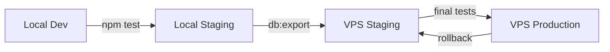

# Workflow развертывания

Полный жизненный цикл разработки, тестирования и развертывания Quote Calculator.

---

## 🎯 Обзор

Quote Calculator использует **четырёхступенчатый процесс** развертывания:



### Окружения

| Окружение | Расположение | Назначение | База данных |
|-----------|--------------|------------|-------------|
| **Local Dev** | Локальная машина | Активная разработка | `./db/quotes.db` |
| **Local Staging** | Docker на локальной машине | Локальные тесты | Docker volume |
| **VPS Staging** | Hostinger VPS | Финальные тесты | Docker volume |
| **VPS Production** | Hostinger VPS | Production | Docker volume |

---

## 📝 Development Workflow

### Шаг 1: Локальная разработка

```bash
# Клонировать репозиторий
git clone https://github.com/yourusername/quote-calculator.git
cd quote-calculator

# Установить зависимости
npm install

# Создать .env файл
cat > .env << 'EOF'
PORT=3000
NODE_ENV=development
STORAGE_TYPE=sqlite
DB_PATH=./db/quotes.db
LOG_LEVEL=debug
LOG_CONSOLE=true
EOF

# Запустить dev сервер
npm run dev

# Сервер доступен на http://localhost:3000
```

### Шаг 2: Разработка функционала

```bash
# Создать feature branch
git checkout -b feature/new-feature

# Разработка...
# Редактирование кода

# Запустить тесты
npm test

# Если тесты проходят - commit
git add .
git commit -m "feat: add new feature"
```

### Шаг 3: Code Review (опционально)

```bash
# Push в remote
git push origin feature/new-feature

# Создать Pull Request на GitHub
# Дождаться review и approval
```

---

## 🧪 Local Staging Testing

### Цель
Протестировать изменения в окружении, максимально близком к production.

### Запуск Local Staging

```bash
# Собрать Docker образ
npm run build

# Запустить staging контейнер
npm run staging:up

# Staging доступен на http://localhost:4001

# Проверка health
curl http://localhost:4001/health
```

### Тестирование

```bash
# 1. Функциональные тесты
npm test

# 2. Ручное тестирование
open http://localhost:4001

# Проверить:
# - Создание/редактирование смет
# - Импорт/экспорт каталогов
# - Печать коммерческих предложений
# - Расчёты (налоги, наценки)
# - Сохранение/загрузка данных
```

### Проверка логов

```bash
# Логи staging контейнера
npm run staging:logs

# Последние 100 строк
docker logs quote-staging --tail 100

# Follow logs
docker logs quote-staging -f
```

### Остановка

```bash
# Остановить staging
npm run staging:down

# Или остановить и удалить volumes
docker-compose -f docker-compose.staging.yml down -v
```

---

## 🚀 VPS Staging Deployment

### Предварительные требования

- [ ] VPS настроен ([см. vps-setup.md](vps-setup.md))
- [ ] Docker и Docker Compose установлены
- [ ] Firewall настроен (порты 80, 443 открыты)
- [ ] DNS записи настроены для staging.yourdomain.com
- [ ] SSH ключи настроены

### Шаг 1: Подготовка кода

```bash
# Merge feature branch в main
git checkout main
git merge feature/new-feature

# Tag версию (опционально)
git tag v2.3.1
git push origin main --tags
```

### Шаг 2: Подготовка базы данных

```bash
# Экспорт из local staging
npm run db:export:local-staging

# Проверка совместимости
npm run db:check ./db-exports/quotes-local-staging-20250113_1530.db

# Результат должен быть: ✅ Compatible
```

### Шаг 3: Деплой на VPS Staging

#### Вариант A: Ручной деплой

```bash
# SSH в VPS
ssh deployer@your-vps-ip

# Перейти в директорию проекта
cd /opt/quote-calculator

# Pull последних изменений
git pull origin main

# Пересобрать staging образ
docker-compose -f docker-compose.vps.yml build quote-staging

# Перезапустить staging контейнер
docker-compose -f docker-compose.vps.yml up -d --force-recreate quote-staging

# Проверка health
curl http://localhost:4001/health
```

#### Вариант B: Скрипт деплоя (рекомендуется)

```bash
# На локальной машине
./scripts/deploy.sh vps-staging

# Скрипт автоматически:
# 1. SSH в VPS
# 2. Pull latest code
# 3. Build образ
# 4. Restart контейнер
# 5. Health check
# 6. Показывает статус
```

### Шаг 4: Импорт базы данных

```bash
# Настроить SSH переменные (на локальной машине)
export VPS_HOST=your-vps-ip
export VPS_USER=deployer

# Импорт БД в VPS staging
npm run db:import ./db-exports/quotes-local-staging-20250113_1530.db vps-staging

# Скрипт:
# 1. Загружает файл на VPS
# 2. Создаёт бэкап текущей БД
# 3. Копирует новую БД в контейнер
# 4. Перезапускает контейнер
# 5. Health check
```

### Шаг 5: Финальное тестирование

```bash
# Проверка доступности
curl -I https://staging.yourdomain.com

# Проверка health endpoint
curl https://staging.yourdomain.com/health

# Ручное тестирование в браузере
open https://staging.yourdomain.com
```

**Что тестировать:**
- ✅ Все основные функции работают
- ✅ База данных загружается корректно
- ✅ HTTPS работает (SSL сертификат валидный)
- ✅ Нет ошибок в логах
- ✅ Performance приемлемый

### Проверка логов на VPS

```bash
# SSH в VPS
ssh deployer@your-vps-ip

# Логи staging
docker logs quote-staging --tail 100 -f

# Логи Nginx
docker logs quote-nginx --tail 50

# Системные логи
sudo journalctl -u docker -n 50
```

---

## 🎉 Production Deployment

### 🚨 КРИТИЧНО - Checklist перед деплоем

**Обязательно выполнить:**

- [ ] Все тесты прошли успешно (local + VPS staging)
- [ ] Code review завершён и approved
- [ ] База данных на VPS staging протестирована
- [ ] SSL сертификаты валидны
- [ ] Создан backup текущей production БД
- [ ] Уведомлены пользователи о maintenance (если требуется)
- [ ] Подготовлен rollback plan

### Шаг 1: Создание backup

```bash
# ОБЯЗАТЕЛЬНО: Backup production БД
export VPS_HOST=your-vps-ip
export VPS_USER=deployer

npm run db:export:vps-production

# Backup сохранится в:
# ./db-exports/quotes-vps-production-20250113_1600.db

# Сохранить в безопасное место
cp ./db-exports/quotes-vps-production-*.db ~/backups/
```

### Шаг 2: Деплой кода

#### Вариант A: Zero-downtime deploy (рекомендуется)

```bash
# SSH в VPS
ssh deployer@your-vps-ip
cd /opt/quote-calculator

# 1. Pull latest code
git pull origin main

# 2. Build новый образ с временным тегом
docker-compose -f docker-compose.vps.yml build quote-production

# 3. Blue-Green deployment (если настроено)
# Или Rolling update:
docker-compose -f docker-compose.vps.yml up -d --no-deps --build quote-production

# 4. Health check
curl http://localhost:4000/health

# 5. Если OK - новая версия работает
# Если FAIL - rollback (см. ниже)
```

#### Вариант B: Maintenance mode deploy

```bash
# 1. Включить maintenance mode (опционально)
# Можно добавить в Nginx конфиг:
# location / { return 503; }

# 2. Остановить production
docker stop quote-production

# 3. Pull и rebuild
git pull origin main
docker-compose -f docker-compose.vps.yml build quote-production

# 4. Запустить
docker-compose -f docker-compose.vps.yml up -d quote-production

# 5. Health check
curl http://localhost:4000/health

# 6. Выключить maintenance mode
```

#### Вариант C: Скрипт деплоя

```bash
# На локальной машине
./scripts/deploy.sh vps-production

# С подтверждением:
# "Are you sure you want to deploy to PRODUCTION? (yes/NO)"
```

### Шаг 3: Миграция базы данных (если требуется)

```bash
# Если нужна новая БД (например, с VPS staging)
npm run db:import ./db-exports/quotes-vps-staging-20250113.db vps-production

# ДВОЙНОЕ ПОДТВЕРЖДЕНИЕ:
# 1. Type 'PRODUCTION' (all caps): PRODUCTION
# 2. Are you absolutely sure? (yes/NO): yes

# Автоматически:
# - Создастся backup текущей БД
# - Загрузится новая БД
# - Перезапустится контейнер
```

### Шаг 4: Smoke Testing

```bash
# 1. Проверка доступности
curl -I https://yourdomain.com

# Ожидаемый результат: HTTP/2 200

# 2. Health check
curl https://yourdomain.com/health

# Ожидаемый результат:
# {
#   "status": "healthy",
#   "version": "2.3.1",
#   "storage": "sqlite",
#   "timestamp": "2025-01-13T16:00:00Z"
# }

# 3. API тесты
curl https://yourdomain.com/api/estimates
curl https://yourdomain.com/api/catalogs

# 4. Открыть в браузере
open https://yourdomain.com
```

### Шаг 5: Мониторинг после деплоя

```bash
# Наблюдать логи первые 5-10 минут
ssh deployer@your-vps-ip
docker logs quote-production -f

# Следить за:
# - ❌ Нет ошибок
# - ❌ Нет 500 errors
# - ✅ Запросы обрабатываются
# - ✅ БД подключается корректно
```

---

## 🔄 Hot Deploy from GitHub

### Настройка GitHub Webhook (опционально)

Автоматический деплой при push в main branch.

#### Шаг 1: Создать deploy скрипт на VPS

```bash
# SSH в VPS
ssh deployer@your-vps-ip

# Создать скрипт
cat > /opt/scripts/github-deploy.sh << 'EOF'
#!/bin/bash
set -e

DEPLOY_ENV=$1  # staging или production
PROJECT_DIR="/opt/quote-calculator"

cd $PROJECT_DIR

# Pull latest
git pull origin main

# Build и restart
docker-compose -f docker-compose.vps.yml build quote-$DEPLOY_ENV
docker-compose -f docker-compose.vps.yml up -d --no-deps quote-$DEPLOY_ENV

# Health check
sleep 5
curl -f http://localhost:${PORT}/health || exit 1

echo "✅ Deploy completed: $DEPLOY_ENV"
EOF

chmod +x /opt/scripts/github-deploy.sh
```

#### Шаг 2: Настроить GitHub Webhook

1. Зайти в GitHub: Settings → Webhooks → Add webhook
2. Payload URL: `https://yourdomain.com/webhook/deploy`
3. Content type: `application/json`
4. Secret: (сгенерировать токен)
5. Events: Just the push event
6. Active: ✅

#### Шаг 3: Добавить webhook endpoint в server.js

```javascript
// server.js
const crypto = require('crypto');

app.post('/webhook/deploy', (req, res) => {
    const signature = req.headers['x-hub-signature-256'];
    const secret = process.env.GITHUB_WEBHOOK_SECRET;

    // Verify signature
    const hash = crypto.createHmac('sha256', secret)
                       .update(JSON.stringify(req.body))
                       .digest('hex');

    if (`sha256=${hash}` !== signature) {
        return res.status(403).send('Invalid signature');
    }

    // Deploy only on push to main
    if (req.body.ref === 'refs/heads/main') {
        const env = process.env.APP_ENV || 'staging';
        exec(`/opt/scripts/github-deploy.sh ${env}`, (error) => {
            if (error) {
                console.error('Deploy failed:', error);
                return res.status(500).send('Deploy failed');
            }
            res.send('Deploy triggered');
        });
    } else {
        res.send('Ignored');
    }
});
```

#### Шаг 4: Тестирование webhook

```bash
# Push в main
git push origin main

# GitHub автоматически отправит webhook
# Проверить логи на VPS:
docker logs quote-staging --tail 50
```

---

## ⏮️ Rollback Procedures

### Сценарий 1: Откат кода (без изменений БД)

```bash
# SSH в VPS
ssh deployer@your-vps-ip
cd /opt/quote-calculator

# 1. Git rollback к предыдущему коммиту
git log --oneline -5  # Найти хороший коммит
git reset --hard abc1234

# 2. Rebuild
docker-compose -f docker-compose.vps.yml build quote-production

# 3. Restart
docker-compose -f docker-compose.vps.yml up -d --force-recreate quote-production

# 4. Health check
curl http://localhost:4000/health
```

### Сценарий 2: Откат базы данных

```bash
# Найти последний бэкап
ls -lt /opt/backups/quote-production/daily/

# Или загрузить локальный бэкап
scp ~/backups/quotes-vps-production-20250113_1500.db \
    deployer@vps:/tmp/rollback.db

# Импорт бэкапа
export VPS_HOST=your-vps-ip
export VPS_USER=deployer

npm run db:import /tmp/rollback.db vps-production

# Подтверждение
# Type 'PRODUCTION': PRODUCTION
# Are you sure?: yes
```

### Сценарий 3: Полный откат (код + БД)

```bash
# 1. Откат кода
ssh deployer@your-vps-ip
cd /opt/quote-calculator
git reset --hard <previous-good-commit>
docker-compose -f docker-compose.vps.yml build quote-production

# 2. Откат БД
npm run db:import <backup-file> vps-production

# 3. Restart
docker-compose -f docker-compose.vps.yml up -d --force-recreate quote-production

# 4. Проверка
curl https://yourdomain.com/health
open https://yourdomain.com
```

### Сценарий 4: Emergency rollback (быстрый)

```bash
# На VPS, если есть предыдущий Docker образ
docker images | grep quote

# Использовать предыдущий образ
docker tag quote-calculator:previous quote-calculator:latest
docker-compose -f docker-compose.vps.yml up -d --force-recreate quote-production
```

---

## 🎯 Best Practices

### Development

1. **Feature branches**
   - Всегда создавайте feature branch
   - Используйте понятные имена: `feature/add-pdf-export`
   - Один feature = один branch

2. **Commits**
   - Используйте conventional commits: `feat:`, `fix:`, `docs:`
   - Пишите понятные commit messages
   - Один логический change = один commit

3. **Tests**
   - Запускайте тесты перед commit
   - Добавляйте тесты для новых функций
   - Поддерживайте coverage > 80%

### Staging

1. **Всегда тестируйте локально сначала**
   ```bash
   npm run build
   npm run staging:up
   # Тестирование
   npm run staging:down
   ```

2. **VPS staging - финальная проверка**
   - Используйте перед каждым production деплоем
   - Тестируйте в условиях, близких к production
   - Проверяйте performance и SSL

3. **База данных**
   - Экспортируйте из local staging
   - Проверяйте совместимость
   - Импортируйте в VPS staging

### Production

1. **Всегда делайте backup**
   ```bash
   npm run db:export:vps-production
   ```

2. **Smoke tests после деплоя**
   - Health endpoint
   - Основные API endpoints
   - UI в браузере

3. **Мониторинг логов**
   - Первые 5-10 минут после деплоя
   - Следите за ошибками
   - Готовьтесь к rollback

4. **Maintenance window**
   - Деплойте в off-peak hours
   - Уведомляйте пользователей
   - Подготовьте rollback plan

### Database Migrations

1. **Проверка совместимости**
   ```bash
   npm run db:check <db-file>
   ```

2. **Бэкапы перед импортом**
   - Автоматические (скрипт делает)
   - Дополнительные ручные

3. **Тестирование на staging**
   - Всегда сначала на staging
   - Проверьте что данные корректны
   - Потом в production

### Rollback

1. **Подготовка**
   - Храните последние 3-5 бэкапов
   - Знайте как быстро откатить
   - Документируйте проблемы

2. **Быстрый rollback**
   - Используйте Git tags
   - Храните предыдущие Docker images
   - Автоматизируйте процесс

---

## 📊 Deployment Checklist

### Pre-deployment

- [ ] Все тесты прошли (local + staging)
- [ ] Code review completed
- [ ] База данных на staging протестирована
- [ ] SSL сертификаты валидны
- [ ] Backup production БД создан
- [ ] Rollback plan подготовлен
- [ ] Пользователи уведомлены (если требуется)

### Deployment

- [ ] Code deployed to production
- [ ] Database migrated (если требуется)
- [ ] Health checks passed
- [ ] Smoke tests passed
- [ ] Логи проверены (нет ошибок)

### Post-deployment

- [ ] Мониторинг первые 10 минут
- [ ] Пользовательские тесты
- [ ] Performance проверен
- [ ] Документация обновлена
- [ ] CHANGELOG обновлён

---

## 🔄 CI/CD (будущее)

### Планируемые улучшения

**GitHub Actions workflow:**
```yaml
name: Deploy to VPS

on:
  push:
    branches: [ main ]

jobs:
  test:
    runs-on: ubuntu-latest
    steps:
      - uses: actions/checkout@v3
      - name: Run tests
        run: npm test

  deploy-staging:
    needs: test
    runs-on: ubuntu-latest
    steps:
      - name: Deploy to VPS Staging
        run: ./scripts/deploy.sh vps-staging

  deploy-production:
    needs: deploy-staging
    runs-on: ubuntu-latest
    if: github.event_name == 'release'
    steps:
      - name: Deploy to VPS Production
        run: ./scripts/deploy.sh vps-production
```

**Преимущества:**
- ✅ Автоматический деплой при push
- ✅ Прогон тестов перед деплоем
- ✅ Уведомления в Slack/Telegram
- ✅ Rollback одной кнопкой

---

## 📚 Дополнительные ресурсы

- [VPS Setup Guide](vps-setup.md)
- [Database Migration Guide](database-migration.md)
- [Configuration Guide](configuration.md)
- [SSL Setup Guide](ssl.md)
- [Monitoring Guide](monitoring.md)
- [Troubleshooting Guide](troubleshooting.md)

---

[← SSL Setup](ssl.md) | [Monitoring →](monitoring.md)
